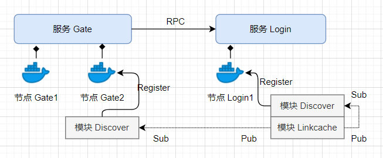

# 简介

---

> braid 可以通过`模块`的组合，构建出适用于大多数场景的微服务架构，默认提供了如下模块;

* RPC 用于`服务`到`服务`之间的接口调用
* Pub-sub 用于`模块`到`模块`之间的消息发布&接收
* Discover 服务发现，用于感知微服务中各个服务中节点的状态变更（进入，离开，更新权重等，并将变更同步给进程内的其他模块
* Balancer 负载均衡模块，主要用于将 RPC 调用，合理的分配到各个同名服务中
* Elector 选举模块，为注册模块的同名服务，选出一个唯一的主节点
* Tracer 分布式追踪，主要用于监控微服务中程序运行的内部状态
* Linkcache 链路缓存，主要用于维护，传入用户唯一凭证（token，的调用链路，使该 token 的调用 a1->b1->c2 ... 保持不变

### Guide
1. [环境搭建（安装支撑服务](../guide/环境搭建.md)
2. [Hello,braid!](../guide/hello_braid.md)
3. [链式调用](../guide/链式调用.md)
4. [在 Docker swarm 中运行](../guide/docker-swarm.md)
5. 如何使用 tracer 模块，监控集群中程序运行的内部状态
6. 如何利用 link-cache 模块，实现惰性缓存（Lazy cache

### 模块

|**Discovery**|**Balancing**|**Elector**|**RPC**|**Pub-sub**|**Tracer**|**Linkcache**|
|-|-|-|-|-|-|-|
|服务发现|负载均衡|选举|RPC|发布-订阅|分布式追踪|链路缓存|
|[discoverconsul](modules/discover-consul.md)|[balancerrandom](modules/balancer-random.md)|[electorconsul](modules/elector-consul.md)|[grpc-client](modules/grpc-server.md)|[mailbox](modules/mailbox-nsq.md)|[jaegertracer](tracer-jaeger.md)|[linkerredis](https://github.com/pojol/braid-go-go/wiki/Guide-4.-%E4%BD%BF%E7%94%A8Link-cahe)
||[balancerswrr](modules/balancer-swrr.md)|[electork8s](modules/elector-k8s.md)|[grpc-server](modules/grpc-server.md)|||

### 工具
* Web
  * sankey chart (观测链路负载情形