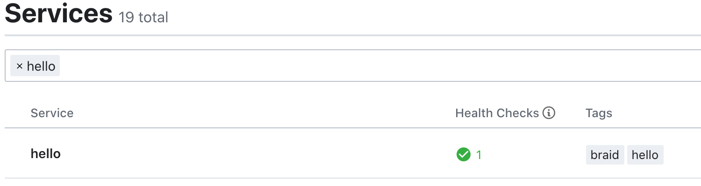

# 2. Hello braid

> 使用 go 1.13+ 进行演示

* 搭建工程
* 示例代码
* 编写Dockerfile
* 运行&测试
* 延展

## 搭建工程

> 构建编程环境

```text
$ mkdir hello_braid
$ cd hello_braid
$ vim main.go `:wq` #创建 main.go 文件
$ go mod init hello_braid
$ go get github.com/pojol/braid@v1.2.11
```

## 示例代码

> 构建 braid ，并将所需的module 注册进来

```go
func main() {

    b, _ := braid.New(
        "hello",
        mailboxnsq.WithLookupAddr([]string{"172.17.0.1:4161"}),
        mailboxnsq.WithNsqdAddr([]string{"172.17.0.1:4150"}))

    b.RegistPlugin(
        braid.Discover(
            discoverconsul.Name,
            discoverconsul.WithConsulAddr("http://172.17.0.1:8500")),
        braid.Balancer(balancerswrr.Name),
        braid.GRPCClient(grpcclient.Name),
        braid.Elector(
            electorconsul.Name,
            electorconsul.WithConsulAddr("http://172.17.0.1:8500"),
        ))

    b.Run()
    b.Init()
    defer b.Close()

    ch := make(chan os.Signal)
    signal.Notify(ch, syscall.SIGTERM)
    <-ch
}
```

## 编写Dockerfile

```text
FROM alpine

COPY ./hello_braid /home/app/

WORKDIR /home/app

# 添加标签用于服务发现
ENV SERVICE_TAGS=braid,hello
ENV SERVICE_14222_NAME=hello

EXPOSE 14222

ENTRYPOINT ./hello_braid $0 $@
```

## 运行&测试

```text
# 编译进程
$ CGO_ENABLED=0 GOOS=linux GOARCH=amd64 go build -o hello_braid main.go

# 构建容器镜像
$ docker build -t hello .

# 运行
$ docker run -d -p 14001:14222/tcp hello:latest
```

> 没有错的话，这个时候在consul中已经能看到刚刚运行的服务了 [http://localhost:8500/ui](http://localhost:8500/ui)



## 延展

> 服务运行后目前除了看到在consul中成功注册。但是还没有涉及到具体的逻辑。 下面我们用一个小例子看下注册在braid中的模块是如何应用的。

```go
// 1. 在上面代码中有将 electorconsul module 注册到braid
braid.Elector(
    electorconsul.Name,
    electorconsul.WithConsulAddr("http://172.17.0.1:8500"),
)

// 2. 添加如下代码， 监听 elector 模块的 StateChange 消息
isub := braid.Mailbox().Sub(mailbox.Proc, elector.StateChange)
ic, err := isub.Shared()
if err != nil {
    log.Fatal(err)
}

// 消息到达函数
ic.OnArrived(func(msg mailbox.Message) error {
    fmt.Println("current service state =>", elector.DecodeStateChangeMsg(&msg).State)
    return nil
})
```

```text
current service state => elector_slave    # 循环竞争master
current service state => elector_slave
current service state => elector_master   # 成功成为master
```

