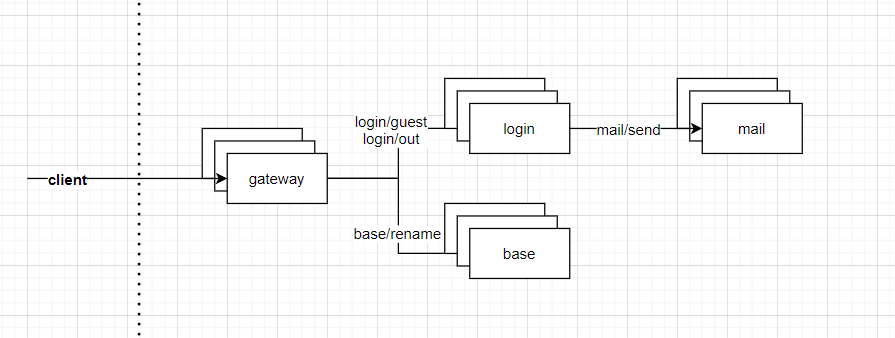

# 3. 链式调用

* 示例图
* 服务节点
* Sample
* 机器人服务


##### 示例图
> 这个guide会使用 bot 来模拟客户端对后台集群发起请请求， 包含1个Bot 若干个 Gate | Base | Mail | Login




##### 服务节点
* Gate
> Api 网关层， 这个服务将内网和外网隔离，主要用于鉴权，限流，路由等功能

* Base
> Base 基础服务节点（假设用户量级少的话，这里可以聚合大部分业务逻辑。

* Mail
> 用于专门处理邮件业务的服务节点

* Login
> 登录服务节点（用户处理用户登录相关业务，当业务量大的时候，我们可以通过这种方式拆分业务。

* Bot
> 机器人服务,用于模拟用户行为。


##### Sample
> 代码位置 => [Sample](https://github.com/pojol/braidgo-sample) <=

* 调用链路

> Bot -> Gate             HTTP (外部 到 内部的请求

> Gate -> Base | Login    RPC (内部之间的 API 互相调用

> Login -> Mail           Message (pub-sub 内部之间的消息订阅发布

```shell
$ sh makeall.sh
$ cd build

$ sh base_run.sh
$ sh gate_run.sh
$ sh login_run.sh
$ sh mail_run.sh

$ cd bot
$ go build main.go
$ ./main -num 1
targets [http://localhost:14001]
num 1
increase false
lifetime 60
strategy default
/v1/base/rename                Req count 10    Average time 4ms   Succ rate 10/10 0kb / 0kb
/v1/login/guest                Req count 1     Average time 8ms   Succ rate 1/1   0kb / 0kb
+--------------------------------------------------------------------------------------------------------+
Req url                                         Req count       Average time       Succ rate
/v1/base/rename                                 10              4ms                10/10      0kb / 0kb
/v1/login/guest                                 1               8ms                1/1        0kb / 0kb
+--------------------------------------------------------------------------------------------------------+
robot : 1 req count : 11 duration : 1s qps : 11 errors : 0
```

